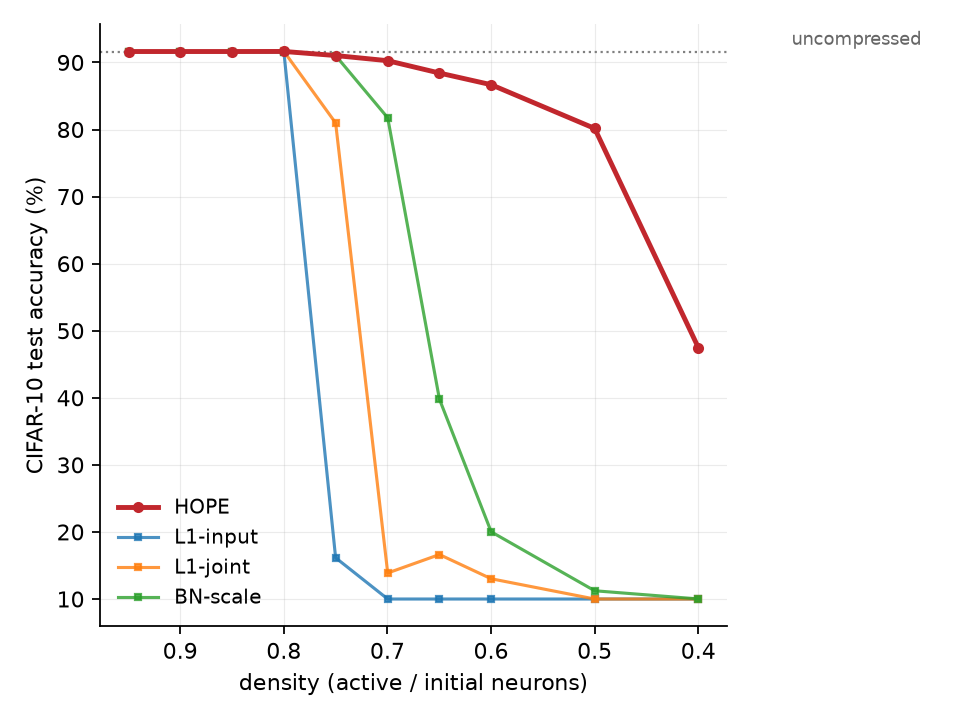

# AngelicHOPE

A from-scratch PyTorch implementation of **HOPE** — *Hilbert Operator for
Progressive Encoding* (Mobahi & Bartlett, 2026, arXiv:2607.21366) — for neural
network compression. 

## Our first results applied to a VGG-8 CNN trained on CIFAR-10.


> this is our most recent result, only showing HOPE's pruning capabilities (this is not the full greedy loop implementation with merging)  
* measured against other pruning methods

## What it does

HOPE treats a neuron as a function $f_i = g_i \otimes w_{\text{out},i}$ living in
a Hilbert space $\mathcal{H}$, rather than as a raw weight vector. This lets the
importance of a neuron be scored analytically. The pipeline is:

1. **Fold** BatchNorm into the preceding conv/linear layer to get effective
    weights and biases.
2. **Score capacity** of every neuron via the closed-form ReLU self-kernel,
    $\|f_i\|_\mathcal{H} = \|w_{\text{out},i}\|\sqrt{K(i,i)}$ 
3. **Compress** with a greedy loop that picks the action (pruning or merging) minimizing 
    distortion-per-parameter $\mathcal{J}/\Delta P$ and executes
    it, keeping the parameter and function representations in sync 

Two granular operations are supported:

- **Pruning** — project a neuron to zero.
- **Merging** — fuse two neurons into a single closed-form parent.

## Scope

This is a **work in progress** and intentionally covers a subset of the paper:

- **In scope:** BN folding, functional capacity, the ReLU self- and cross-kernels,
  pruning, and neuron merging on VGG-8 / CIFAR-10.
- **Out of scope:** block eviction (§8, defined for residual pathways VGG-8 lacks)
  and DEFT.

Because there is no official reference implementation, every equation was
implemented directly from the paper. CIFAR-10 is used instead of the paper's
CIFAR-100 subset due to running on a macbook 

## Status & results

- Pruning is implemented and tested; the accuracy-vs-density curve is in
  `logs/accuracy_vs_density.png`, with a comparison against other pruning methods
  in `logs/density_sweep.csv`.
- Equation 39 (the alpha-divergence relation) is validated in
  `logs/alpha_divergence.png`.
- Kernel implementations are checked against Monte-Carlo references
  (`tests/test_kernels_mc.py`) and an exact bivariate-normal reference via
  Plackett's identity (`bivariate.py`).

## Layout

```
src/hope_implementation/
  models.py      VGG-8 architecture + device / checkpoint helpers
  folding.py     BatchNorm folding (section 3)
  capacity.py    ReLU self-kernel and neuron capacity (sections 4 and 5)
  kernel.py      element-wise and matrix cross-kernels (section 5)
  bivariate.py   exact bivariate-normal CDF reference (Plackett's identity)
  state.py       LayerPack / LayerState / CompressionState + greedy loop (sections 6-9)
  reference.py   Monte-Carlo kernel references
  baselines.py   L1 / BN-scale comparison pruners

logs/   result plots and logs

```


## License

See [LICENSE](LICENSE).
