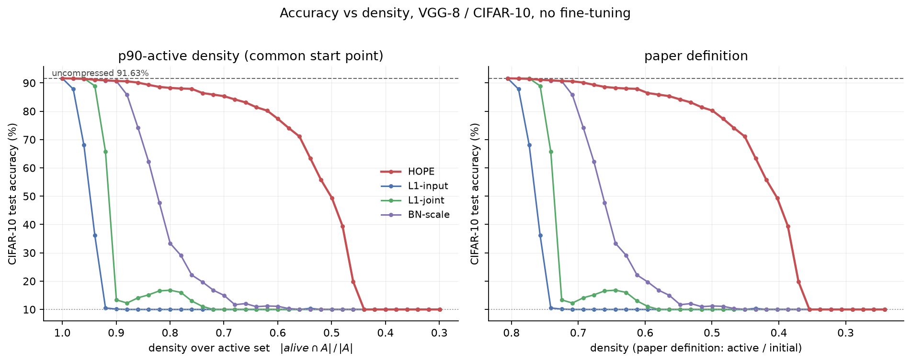
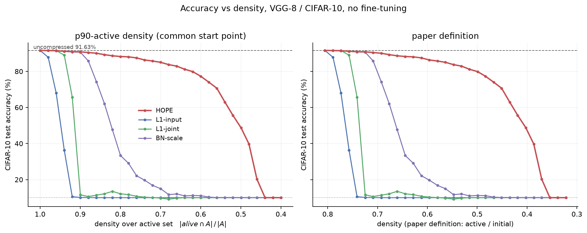

# AngelicHOPE

A from-scratch PyTorch implementation of **HOPE** — *Hilbert Operator for
Progressive Encoding* (Mobahi & Bartlett, 2026, arXiv:2607.21366) — for neural
network compression. 

## Our first results (85.3% accuracy @ 70% density) applied to a VGG-8 CNN trained on CIFAR-10.



> HOPE against three sturcutred magnitude baselines on VGG8 trained on CIFAR10,
> Pruning only, merging is implemented but contributes <2% of selectied actions
> at our scale, reference logs/accuracy_vs_density_merge.png w/ companion logs/density_sweep_merge.csv



## What it does

HOPE treats a neuron as a function $f_i = g_i \otimes w_{\text{out},i}$ living in
a Hilbert space $\mathcal{H}$, rather than as a raw weight vector. This lets the
importance of a neuron be scored analytically. The pipeline is:

1. **Fold** BatchNorm into the preceding conv/linear layer to get effective
    weights and biases.
2. **Score capacity** of every neuron via the closed-form ReLU self-kernel,
    $\|f_i\|_\mathcal{H} = \|w_{\text{out},i}\|\sqrt{K(i,i)}$ 
3. **Compress** with a greedy loop that picks the action (pruning or merging) minimizing 
    distortion-per-parameter $\mathcal{J}/\Delta P$ and executes
    it, keeping the parameter and function representations in sync 

Two granular operations are supported:

- **Pruning** — project a neuron to zero.
- **Merging** — fuse two neurons into a single closed-form parent.

## Scope

This is a **work in progress** and intentionally covers a subset of the paper (PROGRESSIVE ENCODING HAS YET TO BE TESTED!!!!):

- **In scope:** BN folding, functional capacity, the ReLU self- and cross-kernels,
  pruning, and neuron merging on VGG-8 / CIFAR-10.
- **Future Scope:** block eviction 
  and DEFT.

Because there is no official reference implementation, every equation was
implemented directly from the paper. CIFAR-10 is used instead of the paper's
CIFAR-100 subset 

## Status & results

- Pruning is implemented and tested; the accuracy-vs-density curve is in
  `results/figures/accuracy_vs_density.png`, with a comparison against other pruning methods
  in `results/tables/density_sweep.csv`.
- Equation 39 (the invariance of distortion rate ordering) is validated in
  `results/figures/alpha_divergence.png`.
- Kernel implementations are checked against Monte-Carlo references
  (`tests/test_kernels_mc.py`) and an exact bivariate-normal reference via
  Plackett's identity (`bivariate.py`).

## Layout

```
src/hope_implementation/
  models.py      VGG-8 architecture + device / checkpoint helpers
  folding.py     BatchNorm folding (section 3)
  capacity.py    ReLU self-kernel and neuron capacity (sections 4 and 5)
  kernel.py      cross kernel primitives
  bivariate.py   exact bivariate-normal CDF reference (Plackett's identity)
  state.py       LayerPack / LayerState / CompressionState + greedy loop (sections 6, 9 10)
  merge.py       rank 2 -> rank 1 projection; pair geometry,. decoupled     cache, parent generation and physical recovery
  reference.py   Monte-Carlo kernel references
  baselines.py   L1 (input + joint) / BN-scale comparison pruners
  trace.py      save / load/ replay a compression run

results/ figures, csvs and run logs
```


```


note this project is just an exercise for both collaborators 


```


## License

See [LICENSE](LICENSE).
